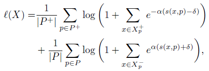
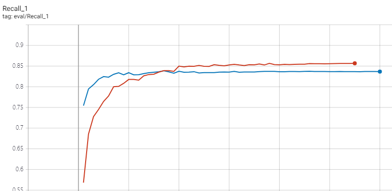

## Proxy Anchor Loss for Deep Metric Learning
Unofficial **_pytorch_**, **_tensorflow_** and **_mxnet_** implementations of Proxy Anchor Loss for Deep Metric Learning. [ref](https://arxiv.org/abs/2003.13911)

### TODO list
+ [x] pytorch version
+ [x] tensorflow version
+ [x] mxnet version

### Overview


## Results
### CARS196

+ red one => proxy anchor loss
+ blue one => norm softmax


## Reference
```
@article{kimproxy,
  title={Proxy Anchor Loss for Deep Metric Learning},
    author={Kim, Sungyeon and Kim, Dongwon and Cho, Minsu and Kwak, Suha}
}
```

